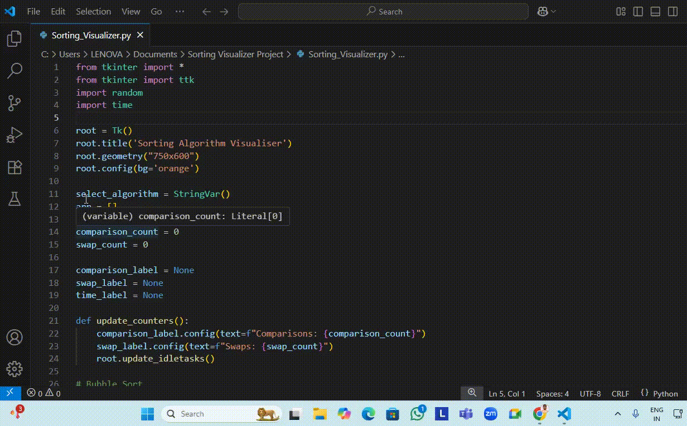

# 🖥️ Sorting Algorithm Visualizer 🎨📊

A **Python Tkinter GUI Application** that visually demonstrates various sorting algorithms in action, with **real-time animation**, **comparison & swap counters**, and **execution time tracking**.

---

## ✨ Features
- 🎯 **Multiple Algorithms**:
  - Bubble Sort
  - Selection Sort
  - Insertion Sort
  - Merge Sort
  - Quick Sort
  - Heap Sort
- ⏳ **Adjustable Sorting Speed** (from instant to slow motion)
- 🔍 **Performance Tracking**:
  - Number of **comparisons**
  - Number of **swaps**
  - **Total time taken**
- 🎨 **Color-coded Visualization** for better understanding:
  - **Red** – Unsorted elements
  - **Yellow** – Elements being compared
  - **Blue** – Sorted section

---

## 📸 Preview
Watch the sorting visualizer in action:




---

## 📂 Project Structure
```
Sorting-Visualizer/
├── sorting_visualizer.py
├── requirements.txt
└── README.md
```


---

## ⚙️ Requirements
- Python **3.x**
- Tkinter (`tkinter` comes pre-installed with Python on most systems)

---

## 🚀 How to Run

### 1️⃣ Clone the Repository
git clone https://github.com/Adi1972004/sorting-visualizer.git
cd sorting-visualizer

### 2️⃣ Install Required Dependencies
pip install -r requirements.txt

💡 **For Linux users**, if Tkinter is not installed:
sudo apt-get install python3-tk

### 3️⃣ Run the Application
python sorting_visualizer.py

---

## 🎯 How It Works
1. **Generate Array** → Creates a random array within the selected size & range.
2. **Select Algorithm** → Choose from Bubble, Selection, Insertion, Merge, Quick, or Heap Sort.
3. **Adjust Speed** → Use the speed slider to slow down or speed up animation.
4. **Start Sorting** → Watch the algorithm in action with color-coded steps.

---

## 📘 Learning Purpose
This project helps:
- Understand **sorting algorithms** visually
- Compare algorithms' efficiency
- Learn **Tkinter GUI programming** in Python

---

## 🛠 Improvements You Can Add
- Add **more sorting algorithms** like Shell Sort, Counting Sort, or Radix Sort
- Option to **import a custom array**
- Dark/Light theme toggle
- Export **performance metrics** to a file

---

## 📜 License
This project is licensed under the **MIT License** – you can use, modify, and distribute with credit.

---

## 💡 Author
**Aditya Chandel**  
[GitHub Profile](https://github.com/Adi1972004)

---

✨ _Happy Coding & Keep Learning!_ ✨
